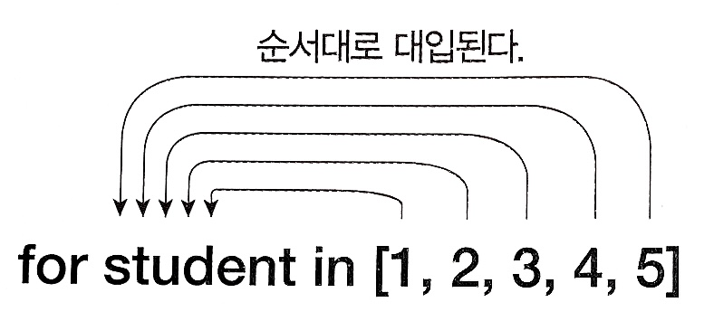

# 제어문

---

## 0. 개요

- 주어진 조건의 결과값에 따라 프로그램의 수행 순서를 제어하거나 문장들의 수행 회수를 조절하는 문장
- 종류
  - 조건문
    - if 문
      - If ~
      - if~ else
      - 다중 if~ elif~ else
  - 반복문
    - for 문
      - 반복횟수가 결정되어 있을 때
    - while 문
      - 반복횟수가 조건에 따라 결정될 때
    - for 문과 while 문 중 편한 것 사용 
  - 기타 제어문
    - continue 문
    - break 문

## 1. 조건문 - if 문

### if ()

- 조건식이 참일 때 주어진 문장을 수행
- 조건식이 거짓이면 아무것도 수행하지 않는다

```python
if (조건식) :
  참일 경우 수행되는 문장
```

### if ~ else ()

- 조건식이 참일 때 if 문 수행
- 조건식이 거짓이면 else 문 수행

```python
if (조건식) :
  참일 경우 수행되는 문장
else :
  거짓일 경우 수행되는 문장
```

### if ~ elif ~ else ()

- 또다른 조건이 있을 때 elif 사용

```python
if (조건식1) :
  조건식 1이 참일 경우 수행되는 문장
elif (조건식2):
  조건식 2가 참일 경우 수행되는 문장
else :
  앞의 모든 조건식이 거짓일 경우 수행되는 문장
```

## 2. 반복문

### for 문

- 리스트나 문자열의 요소를 순서대로 정해진 횟수만큼 반복하면서 루프의 명령을 실행

  ```python
  for 변수 in list or 범위 :
  	반복문장(명령)
  ```

  - 리스트는 [ ] 안에 요소를 나열해 놓은 일종의 배열

  - for 문은 요소를 하나씩 꺼내 제어 변수에 대입, 루프에서 처리

    ```python
    for student in [1, 2, 3, 4, 5]:
      print(student, "번 학생의 성적을 처리한다.")
    1 번 학생의 성적을 처리한다.
    2 번 학생의 성적을 처리한다.
    3 번 학생의 성적을 처리한다.
    4 번 학생의 성적을 처리한다.
    5 번 학생의 성적을 처리한다.
    ```

    

  - range() 함수

    - 일정 범위의 리스트를 만들고 리스트 내의 요소를 반복할 때 range 명령으로 순차적으로 증가하는 리스트 생성

    ```python
    range(시작, 끝, 증가값)
    # 범위의 원칙에 따라 끝값 자체를 포함하지 않는다
    ```

  - 앞의 예시를 range를 활용해 작성

    ```python
    for student in range(1, 6):
      print(student, "번 학생의 성적을 처리한다.")
    1 번 학생의 성적을 처리한다.
    2 번 학생의 성적을 처리한다.
    3 번 학생의 성적을 처리한다.
    4 번 학생의 성적을 처리한다.
    5 번 학생의 성적을 처리한다.
    ```


- 다중 for 문 (중첩 루프)

  - for 문 안의 for 문

    ```python
    for y in range(3):
      for x in range(5):
        print(x, end=" ")
      print()
    0 1 2 3 4
    0 1 2 3 4
    0 1 2 3 4
    ```

### while 문

- 정해진 조건에 따라 반복 수행

- 조건식을 먼저 확인한 후 `True` 일 경우 조건이 만족하는 동안 문장을 반복 수행

- 초기값을 반드시 지정해야 함

  - 초기값이 없으면 조건이 맞는지 알 수 없음
  - 변동이 없으면 반복문을 종료할 수도 없음

  ```python
  초기값
  while 조건:
    명령
  ```

  