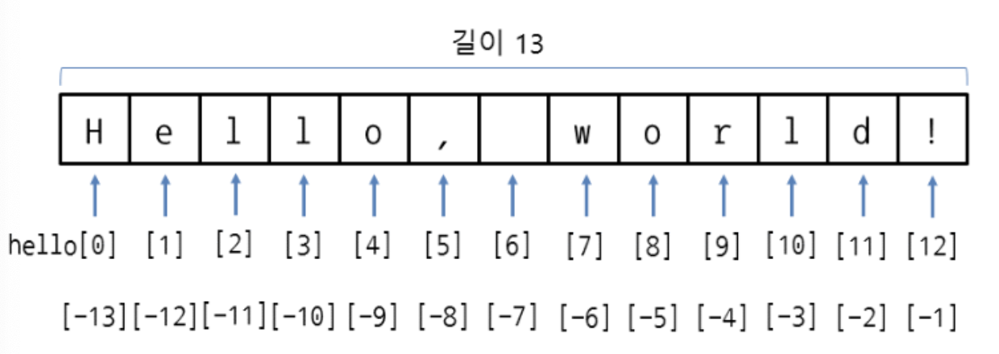

# 문자열

## 0. 개요

- 문자열(String)이란 문자, 단어 등으로 구성된 문자들의 집합
- 파이썬의 기본 타입

## 1. 문자열은 어떻게 만들고 사용할까?

1. 큰 따옴표`"`로 양쪽 둘러싸기

   ```python
   "hello world"
   ```

2. 작은 따옴표 `'`로 양쪽 둘러싸기

   ```python
   'hello world'
   ```

3. 큰 따옴표를 3개 연속 `"""` 사용해서 양쪽 둘러싸기

   ```python
   """hello world"""
   ```

4. 작은 따옴표를 3개 연속 `'''` 사용해서 양쪽 둘러싸기

   ```python
   '''hello world'''
   ```

- 문자열 내부에 따옴표를 포함시키고 싶을 때

  1. 문자열에 작은 따옴표 `'` 포함시키기

     - 문자열을 큰 따옴표 `"` 로 둘러싸기

     ```python
     food = "Python's favorite food is perl"
     ```

  2. 문자열에 큰 따옴표 `` 포함시키기

     - 문자열을 작은 따옴표 ` 로 둘러싸기

     ```python
     say = '"Python is very easy." he says.'
     ```

  3. 백슬래시`\`를 사용해서 따옴표를 문자열에 포함시키기

     - 백슬래시 뒤의 기호는 문자열을 둘러싸는 기호가 아니라 문자 그 자체를 뜻하게 됨.

     ```python
     food = 'Python\'s favorite food is perl'
     say = "\"Python is very easy.\" he says."
     ```

- 여러 줄인 문자열을 변수에 대입하고 싶을 때

  1. 줄을 바꾸기 위한 이스케이프 코드 `\n` 삽입하기

     ```python
     multiline = "Life is too short\nYou need Python"
     ```

  2. 연속으로 따옴표 3개 사용하기

     ```python
     multiline = ```
     Life is too short
     You need python
     ​```
     ```

## 2. 문자열 연산

1. 문자열 더해서 연결하기(Concatenation)

   ```python
   head = "python"
   tail = " is fun!"
   print(head + tail)
   python is fun!
   ```

2. 문자열 곱하기

   ```python
   a = "python"
   print(a * 2)
   pythonpython
   ```

3. 문자열 길이 구하기

   ```python
   a = "Life is too short"
   len(a)
   17
   ```

## 3. 문자열의 인덱싱과 슬라이싱

> 인덱싱(indexing): 가리키다
>
> 슬라이싱(Slicing): 잘라내다

### 인덱싱(indexing)

- 첨자(index)`[ ]`로 문자의 주소, 위치를 나타내는 것
- 가장 왼쪽 0에서 시작하며 오른쪽으로 갈수록 숫자가 커짐
- `-`주소도 가능. 가장 오른쪽이 -1이고 왼쪽으로 갈수록 숫자가 커짐



```python
hello = "hello, world!"
print(hello[0])
h
print(hello[-1])
!
print(hello[4])
o	
```

### 슬라이싱(slicing)

- 문자열 중 일부분을 추출하는 것(잘라내는 것)
- 인덱스를 사용

```python
# 구조
[begin:end:step]
```

```python
# 활용
# 일정한 형식의 문자열에서 원하는 정보만 빼낼 수 있음
file = "20201230-1555.png"
print("촬영 날짜: "+ file[4:6] + "월 " + file[6:8] +"일")
촬영 날짜: 12월 30일
print("촬영 시간: "+ file[9:11] + "시 " + file[11:13] +"분")
촬영 시간: 15시 55분
print("확장자: "+ file[-3:])
확장자: png
```

```python
# step 설정
yoil = "월화수목금토일"
print(yoil[::2])
월수금일
print(yoil[::-1])
일토금목수화월
```

- 슬라이싱을 활용한 문자 바꾸기

  - 문자열의 요솟값은 바꿀 수 없다

    ```python
    a = "pithon"
    a[1]
    'i'
    a[1] = 'y'
    TypeError: 'str' object does not support item assignment
    ```

  - 슬라이싱 활용

    ```python
    a = "pithon"
    a[:1]
    'p'
    a[2:]
    'pthon'
    a[:1] + 'y' + a[2:]
    'python'
    ```
